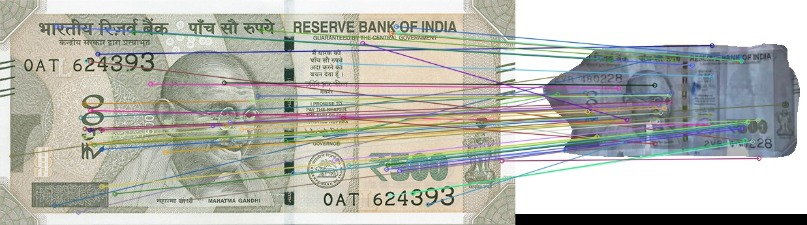

# Money-Mitra | A State-of-the-Art Solution for Soiled Currency Detection & Adjudication

This project aims to create an end-to-end ecosystem for detecting soiled Indian currency notes from user-uploaded images, performing automated adjudication, and allowing users to book appointments at nearby bank branches for note exchange.

## Technical Pipeline

The system uses a robust 4-step pipeline for accurate and scalable adjudication:

### 1. Note Segmentation & Classification
- Model: Mask R-CNN (He et al., 2017)
- Dataset: 200 labeled entries from the Soiled Indian Currency Dataset (Meshram et al., 2023)
- Output: Segmented note images and their respective denominations.

  

### 2. Keypoint Detection with SIFT
- Algorithm: Scale-Invariant Feature Transform (Lowe, 2004)
- Purpose: Detect keypoints and descriptors invariant to scale, rotation, or translation in segmented notes.

  

### 3. Feature Matching & Image Warping
- Method: Brute-Force Matcher
- Transformation: Homography matrix is computed to align the segmented note with a truth/reference image.
- Technique: A modified image stitching method (Lowe et al., 2006) is used to overlay the images.

  

### 4. Adjudication & Appointment Booking
- Overlaid images are analyzed to determine note quality and whether replacement is needed.

## Installation

Clone the repository and install required dependencies:
#### 1. Environment Check & Setup
```bash
%pip install -r requirements.txt
```

## File Structure
```
├── test_model.ipynb          # Evaluation notebook
├── requirements.txt          # Required dependencies
├── logs/                     # Trained model weights
├── data/                     # Unseen test images
├── assets/                   # Optional: visual output samples
```
