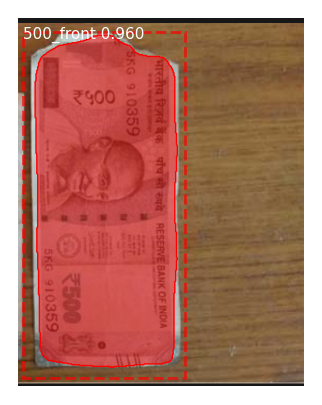
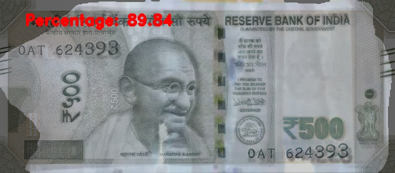

# Money-Mitra | A State-of-the-Art Solution for Soiled Currency Detection & Adjudication

This project aims to create an end-to-end ecosystem for detecting soiled Indian currency notes from user-uploaded images, performing automated adjudication, and allowing users to book appointments at nearby bank branches for note exchange.

## Technical Pipeline

The system uses a robust 4-step pipeline for accurate and scalable adjudication:

### 1. Note Segmentation & Classification
- Model: Mask R-CNN (He et al., 2017)
- Dataset: 200 labeled entries from the Soiled Indian Currency Dataset (Meshram et al., 2023)
- Output: Segmented note images and their respective denominations.

  

### 2. Keypoint Detection with SIFT
- Algorithm: Scale-Invariant Feature Transform (Lowe, 2004)
- Purpose: Detect keypoints and descriptors invariant to scale, rotation, or translation in segmented notes.

  

### 3. Feature Matching & Image Warping
- Method: Brute-Force Matcher
- Transformation: Homography matrix is computed to align the segmented note with a truth/reference image.
- Technique: A modified image stitching method (Lowe et al., 2006) is used to overlay the images.

  

### 4. Adjudication & Appointment Booking
- Overlaid images are analyzed to determine note quality and whether replacement is needed.

## Installation

Clone the repository and install required dependencies:
#### 1. Environment Check & Setup
```bash
%pip install -r requirements.txt
```

## File Structure
```
├── test_model.ipynb          # Evaluation notebook
├── requirements.txt          # Required dependencies
├── logs/                     # Trained model weights
├── dataset/                  # Unseen test images
├── assets/                   # Optional: visual output samples
```

## Training the Model
To train your own version of the model, follow these steps:

### Download the Pretrained Weights
Download the mask_rcnn_coco.h5 file from the [official repository](https://github.com/matterport/Mask_RCNN/releases).

### Use the Stratified Dataset
Organize your labeled Indian currency notes in a stratified directory structure (by denomination and condition) under the following directory:
```
├── dataset
    ├──Train               # Sample images for training
    ├──Test                # Sample images for testing
    ├──Val                 # Sample images for validation
```

### Train Using the Notebook
Although this notebook is named test_model, you can adapt it by un-commenting the training blocks to begin training.

## License
This repository is a **state-of-the-art solution** developed for educational and research purposes.  
The developers **reserve all rights** pertaining to commercial deployment and derivative works intended for operational use.

You are permitted to:
- Use this code for academic research or personal experimentation.
- Modify and build upon it **non-commercially**, provided proper credit is given.
However:
- **Commercial deployment**, distribution, or productization of this solution **requires explicit permission** from the authors.
- This repository builds upon the open-source [Matterport Mask R-CNN implementation](https://github.com/matterport/Mask_RCNN), which is licensed under the MIT License. Please review their repository for specific terms related to their code.

Trained weights (`mask_rcnn_coco.h5`) used as the base model are released by the original authors under similar open licenses, and are meant strictly for research and educational purposes.
